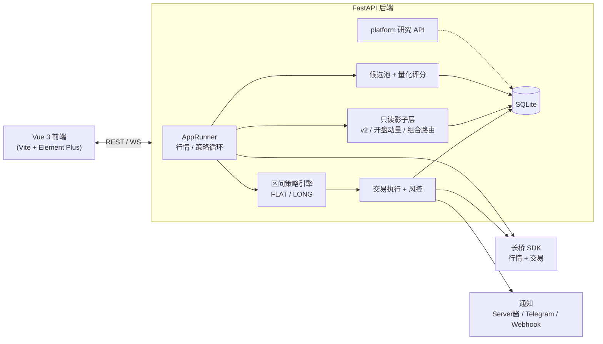

# Auto Trade

基于 [长桥 Longbridge](https://open.longbridge.com/) OpenAPI 的自动化区间交易系统，并附带只读研究层：动态候选池 / 量化评分、Strategy v2 与开盘动量影子、组合路由对照、以及大量 `/api/platform/*` 研究计算端点。**实盘路径默认 P0 安全边界**（禁做空开仓、禁加仓、LLM 仅影子、影子策略永不下单）。

## 架构



数据流：`长桥 WebSocket 行情 → 策略引擎 → 风控判断 → 订单执行 → DB 存档 + Web UI 展示 + 通知推送`

## 功能

### 区间交易策略
- 设定最低价 `buy_low` 和最高价 `sell_high`
- 空仓且价格 ≤ `buy_low` 时买入开多；持有多仓且价格 ≥ `sell_high` 时卖出平仓
- P0 安全策略固定禁用做空开仓和已有持仓加仓，策略、API 与部署配置均不能开启
- 新开仓受数量、名义金额、单笔风险和收盘前截止等硬上限约束
- 价格在区间内时观望，不操作
- 60 秒冷却期，防止阈值附近抖动触发连续下单

### 状态机

```
空仓(flat) ──价格≤buy_low──► 持仓(long) ──价格≥sell_high──► 空仓(flat)
```

### 风控
- 单日最大亏损限制（默认 $5000）
- 可选的历史已实现盈亏高水位回撤限制；`max_drawdown_amount` 为 `null` 或 `0` 时关闭，达到限额后以 `DRAWDOWN_LIMIT` 自动暂停
- 连续亏损 N 次自动暂停（默认 3 次）
- 持仓按价格止损、最长持有时间和收盘前清仓规则强制减仓
- **按交易所本地日历日**切日（US 用美东、HK 用香港时间），避免 UTC 午夜误重置日盈亏与连损计数
- 手动暂停/恢复交易
- Kill Switch 紧急停止

### 盈亏与成本跟踪
- 加权入场成本（`tracked_entries`）持久化到 SQLite，进程重启后平仓 PnL 仍按系统记录的均价计算，不依赖券商可能滞后的 `avg_price`
- 启动时与券商持仓对账；数量偏差过大时写入 `TRACKED_ENTRY_DRIFT` 事件（决策时间线可见）

### 行情与运行时
- 长桥 WebSocket 推送行情；若 RTH 内推送静默超过约 90 秒，runner 自动退订并重订
- 推送中断时仍可通过每 15 秒主动 `get_quote` 续命；主动拉取不计入「推送活跃」检测
- 动态候选池与量化 v5 的跨日特征统一使用前复权 K 线，避免拆股制造虚假收益、波动率和 ATR；交易触发与成交台账仍使用实际未复权价格
- 动态候选池同时记录分散型 12-1 月度动量轮动 Shadow v3（252 日回看、跳过最近 21 日、200 日均线、Top 8、每风险组最多 1 只）；另行冻结 Top 6、每风险组最多 2 只的收益挑战者。组合均在上月最后交易日收盘后冻结，并按下月首个交易日开盘等权建仓，月中刷新只更新估值而不重排成分
- 每次候选池刷新使用最多 1000 根前复权日线执行严格月频 walk-forward：信号只看上月末，按次月首个交易日开盘成交，逐笔计入费用、滑点与流动性价差，并分别输出训练段、最近 12 个月验证段及 QQQ/DIA 基准；当前成分股幸存者偏差和前向样本不足始终阻止自动晋级
- 每日运行记录会持久化当月冻结登记与净清算快照（双边费用、QQQ/DIA 超额、前向会话数）；月初后首次部署的组合明确标为回填且不计入前向证据，基准或登记异常时轮动选择关闭，不会退回每日重排，也不会自动晋级或下单
- FastAPI `lifespan` 在后台线程启动 runner，避免启动期阻塞 `/api/health`
- Runner 后台约每 15 秒将券商当日订单同步到本地库

### 通知与审计
- 多渠道通知：[Server酱](https://sct.ftqq.com/) + Telegram Bot + 自定义 Webhook，按 `severity_floor` 分级（`INFO` / `WARNING` / `CRITICAL`）路由
- `INFO` / `WARNING` 通知按标题与正文指纹在可配置时间窗内去重，仅成功分发后生效；`CRITICAL` 始终立即发送
- Telegram 渠道通过凭证页或 `PUT /api/credentials` 配置 `bot_token` 与 `chat_id`；读取配置和审计摘要时 `bot_token` 固定脱敏为 `***`
- `notify_risk_event` 自带 severity 映射：`KILL_SWITCH` / `ORDER_PERSISTENCE_FAILED` → `CRITICAL`；`REJECTED` / `ORDER_FAILED` / `ORDER_TIMEOUT` / `DAILY_LOSS` / `DRAWDOWN_LIMIT` → `WARNING`
- 操作审计：策略修改、凭证修改、启停、暂停/恢复、Kill Switch、撤单都会写入 `audit_logs` 表，含 `actor_hash`（SHA-256 X-API-Key 前 16 hex）、`source_ip`、脱敏 `request_summary`、`severity`、`result`
- Decision Timeline 支持 `source=trade|audit|llm|risk|all` 统一查看交易 / 审计 / LLM / 风控事件，`event_type` 多选筛选

### 交易时段守卫
- `trading_session_mode = RTH_ONLY` 时仅在常规交易时段允许策略新下单；非交易时段记录 `ORDER_SKIPPED` + `skip_category=SESSION` 与 `TRADING_SESSION_BLOCKED` 审计。P0 的 LLM 实盘下单始终关闭
- `CANCEL_PENDING` 撤单不受时段守卫限制（允许非 RTH 清理挂单）
- 默认 `ANY`，用户主动切到 `RTH_ONLY` 才生效；RTH 判定包含 2024–2027 年 NYSE / HKEX 静态休市日历和提前收盘时间

### 券商韧性
- `BrokerGateway._call_with_retry` 分档退避：订单（默认 3 次）全量指数退避；行情（默认 1 次）轻量重试；K 线响应含非法 OHLCV 时也先按同一上限重拉，仍异常才过滤坏行并保留有效行
- 每次重试写 `audit_logs.action=BROKER_RETRY`；重试耗尽走原 `_is_auto_resumable_pause_reason` → pause 路径

### 回测
- CSV 历史价格回测（`POST /api/backtest/run`），验证区间参数与风控规则
- `max_drawdown_amount` 按全程已实现净盈亏高水位限制回撤（`0` 关闭）；触发后本次回测不再开新仓，但已有仓位仍可正常平仓
- `trailing_stop_pct` 为每笔多/空仓启用按持仓后最高/最低价回撤百分比触发的移动止损，`0` 表示关闭
- 可选复现市场/时间约束：`market`、`trading_session_mode`、`max_holding_minutes`、`entry_cutoff_minutes_before_close`、`flatten_minutes_before_close`；时间止损和收盘平仓按观测 K 线收盘价加滑点强制退出，不受最低盈利门槛阻挡
- 回测的 `ANY` 仅保留历史全时段行为；实盘安全层即使配置为 `ANY` 也不允许非 RTH 新增长仓，因此该模式不能视为实盘执行等价
- 可选复现部署入场门控：`opening_warmup_minutes`、`entry_crossing_required`、`max_entries_per_symbol_per_day`。OHLC 的“新鲜穿越”仅在本根开盘位于阈值外侧且随后触及时成立，属于保守 K 线近似，不等同 30 秒逐笔报价证据
- **参数扫描**（`POST /api/backtest/sweep`）：在当前 CSV 上对 `buy_low` / `sell_high` / `min_profit_amount`（可选 `quantity` / `fee_rate` / `slippage_pct` / `stop_loss_pct`）做网格搜索，按 Sharpe / Sortino / Calmar / 盈亏比 / 总回报 排名，返回 Top-N 结果表 + `(buy_low, sell_high)` 热力图；`buy_low ≥ sell_high` 的无效组合自动跳过。即时、离线、纯内存，与「实验」页的保存式批量回测不同。
- Web UI **Backtest** 页：上传/粘贴 CSV、查看收益曲线与交易明细、参数扫描（点击结果行可把最优配置回填表单）

### 策略复盘与观察列表

- **复盘**（`/#/review`，`GET /api/review`）：按交易日 × 标的聚合订单、事件、运行时快照与 LLM 交互；支持导出
- **观察列表**（`/#/watchlist`）：多标的行情与量化评分；动态候选池结果可同步为只读 watchlist，**不会自动切换主交易标的**
- **交易报告**（`/#/reports`）：区间报告与定时日报（可选推送）
- **告警 / 通知中心**：条件告警规则 + 已发送通知分发日志

### 动态候选池与量化评分（默认关闭）

- Nasdaq-100 / DJIA 目录上的日频筛选；前复权 K 线做特征，成交触发仍用未复权价格
- 月频 walk-forward 轮动影子（12-1 动量等）只累积前向证据，**不自动晋级、不自动下单**
- 量化 v5 评分可在 RTH 内自动刷新到期标的；主交易标的优先
- 晋级 readiness（`GET /api/universe/promotion-readiness`）仅供人工复核

### LLM 区间顾问（可选）
- DeepSeek 或 MiniMax 分析建议 `buy_low` / `sell_high`；预览接口仅读，不应用区间、不下单
- 手动与定时分析统一经过置信度、区间宽度和相对现价偏离守卫；P0 固定为影子模式，仅记录建议
- Prompt 使用长桥真实日 K / 1 分钟 K（`BrokerGateway.get_candlesticks`），ATR(14) 与布林带基于历史 K 线计算
- P0 永久禁用 LLM 实盘下单，不能通过策略字段、API 或环境变量开启
- `CANCEL_REPLACE`、订单价格偏离和发单冷却参数仅保留兼容性；P0 不会进入对应的券商下单路径

### Strategy v2 / 开盘动量 / 组合路由影子（只读）

- **Strategy v2**：RTH 内已结算 1 分钟 bar → session VWAP、因果 residual z-score、5 分钟确认；ADX / 实现波动率门禁；long-only、禁止加仓；不利滑点 + 冻结费率估算净收益；stop / target / 最大持仓 / 收盘前强平、MAE / MFE
- 硬安全线：最长持仓 60 分钟、收盘前 45 分钟停入场、前 15 分钟强制虚拟平仓；**无订单执行依赖**
- Lab「策略 v2 影子」：特征、gate、状态、虚拟绩效、决策导出；离线 replay 永不写库
- **开盘动量影子**（`/api/opening-momentum-shadow`）：盘前冻结池上的开盘路径效率 / 强弱延续对照，仅记录；弱广度路径挑战者固定为 3 分钟信号、市场中位收益 `[-50, 0] bps`、候选路径效率至少 `0.70`、持仓 60 分钟及 1% 止损，并从 2026-07-27 起只累计未见前向证据；同信号的 4% 灾难止损挑战者与其做配对退出对照，同样只从 2026-07-27 起计证据（截至 2026-07-24 的历史分钟线仅视为设计样本）；个股隔夜跳空、昨收到信号收益及同期 QQQ / DIA 收益仅作为因果遥测，不参与门禁或下单
- **组合路由影子**：单资金槽跨标的路由对照；**live exit challenger** 对真实成交做 forward-only 锁盈对照——均不下单、不自动晋级
- 可选 **live regime gate**：开仓前要求主标的最新 v2 shadow 门禁通过（默认关）

### 交易执行安全
- 普通平仓（非止损）在满足 `min_profit_amount` 之前，还需扣除按 `fee_rate_us` / `fee_rate_hk` 估算的双边手续费；费用后净收益仍不足时跳过并记录 `FEE` 原因
- 止损路径（`allow_loss_exit=True`）完全绕过费用门槛与改价/冷却限制，确保止损优先
- Decision Timeline 与 Dashboard 最近动作按分类展示跳过原因：`FEE` / `RISK` / `PENDING` / `POSITION`；`REPRICING` / `COOLDOWN` 为保留的 LLM 订单事件类型，P0 不执行 LLM 实盘订单
- 回测引擎拥有独立的 `fee_rate` / `fixed_fee` / `slippage_pct`，不读取实盘的市场费率配置，离线模拟结果与实盘独立

## 技术栈

| 层 | 技术 |
|---|---|
| 后端 | Python 3.11+, FastAPI, SQLAlchemy 2.0, SQLite |
| 券商 SDK | longport (Longbridge Python SDK) |
| 前端 | Vue 3, Vite, Element Plus, TypeScript |
| 部署 | Docker Compose |

## 前置条件

- Docker 和 Docker Compose（推荐部署方式）
- 或 Python 3.11+ / Node.js 20.19+（本地开发）
- 长桥账户：需获取 App Key、App Secret、Access Token
- （可选）Server酱 SendKey：用于微信通知
- （可选）Telegram Bot Token + Chat ID：用于 Telegram 通知

## 快速开始

### 1. 配置凭证

```bash
cp .env.example .env
```

编辑 `.env`：

```env
LONGPORT_APP_KEY=你的AppKey
LONGPORT_APP_SECRET=你的AppSecret
LONGPORT_ACCESS_TOKEN=你的AccessToken
AUTO_TRADE_SCT_KEY=你的Server酱SendKey          # 可选
CREDENTIAL_MASTER_KEY=你的凭证加密主密钥           # 建议设置（Web UI 保存凭证前）
AUTO_TRADE_LLM_PROVIDER=deepseek                  # deepseek 或 minimax；默认 deepseek
DEEPSEEK_API_KEY=你的DeepSeek密钥                # 可选，启用 LLM 区间顾问时需要
MINIMAX_API_KEY=你的MiniMax密钥                  # provider=minimax 时需要
MINIMAX_BASE_URL=https://api.minimaxi.com/v1      # Token Plan base URL
AUTO_TRADE_API_KEY=                              # 仅 dev/test 可留空；prod 需要设置
AUTO_TRADE_FRONTEND_PORT=8080                    # Docker 前端监听端口（默认绑定 127.0.0.1）
```

长桥凭证获取：<https://open.longbridge.com/>

Server酱可继续通过 `AUTO_TRADE_SCT_KEY` 环境变量配置。Telegram 与 Webhook 属于多渠道凭证配置，通过 Web UI 的 **Credentials** 页面或 `PUT /api/credentials` 保存，例如：

```json
{
  "notification_channels": [
    {
      "type": "telegram",
      "severity_floor": "WARNING",
      "bot_token": "<Telegram Bot Token>",
      "chat_id": "<Chat ID>"
    }
  ]
}
```

`GET /api/credentials` 不返回 Telegram Bot Token 明文，仅返回 `"bot_token": "***"`。

### 2. 启动服务

```bash
docker compose up --build -d
```

- 前端 Web UI（含 API 反向代理）: http://localhost:8080
- 就绪检查: http://localhost:8080/api/ready
- 局域网访问: 如需手动暴露，请在 `.env` 里显式设置 `AUTO_TRADE_FRONTEND_BIND=0.0.0.0`

### 3. 配置策略

打开 Web UI → **Strategy** 页面，填写：

| 参数 | 说明 | 示例 |
|------|------|------|
| Symbol | 股票代码（格式：`CODE.MARKET`） | `AAPL.US` |
| Market | 市场 | `US` / `HK` |
| Buy Low Price | 触发买入的最低价 | `150.00` |
| Sell High Price | 触发卖出的最高价 | `200.00` |
| Position Add-ons | 兼容字段；P0 固定关闭，不能通过部署或策略配置开启 | `false` |
| Max Position Quantity | 单标的最大持仓数量 | `100` |
| Max Position Notional | 单标的最大名义金额（报价币种） | `5000` |
| Max Risk Per Trade | 单笔最大价格风险（报价币种） | `250` |
| Stop Loss | 持仓价格止损上限 | `1.0%` |
| Max Holding Minutes | 最长持有时间 | `60m` |
| Max Daily Loss | 单日最大亏损额度 | `5000` |
| Max Drawdown Amount (`max_drawdown_amount`) | 历史已实现盈亏高水位回撤额度；`null` / `0` 关闭 | `null` |
| Max Consecutive Losses | 连续亏损暂停阈值 | `3` |
| US Estimated Fee Rate (`fee_rate_us`) | 美股单边预估费率，用于实盘普通平仓的费用后收益门槛 | `0.05%` |
| HK Estimated Fee Rate (`fee_rate_hk`) | 港股单边预估费率，用于实盘普通平仓的费用后收益门槛 | `0.30%` |
| LLM Repricing Threshold (`min_repricing_pct`) | 保留的 LLM 订单参数；P0 不执行撤单重挂 | `0.30%` |
| LLM Action Cooldown (`llm_action_cooldown_seconds`) | 保留的 LLM 订单参数；P0 不执行 LLM 实盘发单 | `60s` |

保存后在 **Dashboard** 点击 **Start** 启动策略运行。

### 4. 停止服务

```bash
docker compose down
```

## 本地开发

### 前置要求

- Python 3.11+（与 `pyrightconfig.json` 中的 `pythonVersion` 保持一致；`tests/test_ws.py` 依赖 3.10+ 的 `asyncio` 行为）
- Node.js 20.19+

### 后端

```bash
cd backend
python3 -m venv .venv && source .venv/bin/activate  # 推荐使用 venv 锁定 Python 3.11+
pip3 install -r requirements.txt
pip3 install -r requirements-dev.txt  # LSP/type-check/test development dependencies
cp ../.env.example ../.env  # 本机 .env 默认 sqlite:///./data/auto_trade.db，cwd=repo 根即可
uvicorn app.main:app --reload --port 8000
```

> 本机路径 (`./data/...`) 与 Docker 路径 (`/app/data/...`) 不一致：compose 启动时通过环境变量 `AUTO_TRADE_DATABASE_URL=sqlite:////app/data/auto_trade.db` 覆盖，本机 `uvicorn` 直接用相对路径即可，**不要**把容器绝对路径写进 `.env.example`。

### 前端

```bash
cd frontend
npm install
npm run dev     # http://localhost:3000，自动代理 /api 和 /ws 到后端
```

### 运行测试

```bash
cd backend
python3 -m pytest tests/ -v                     # 全部测试
python3 -m pytest tests/ --cov=app --cov-report=term  # 含覆盖率
python3 -m pytest tests/test_engine.py -v        # 单模块

# 只读复算轮动证据；不读取持仓、不提交订单
python3 scripts/evaluate_rotation_walk_forward.py --history-bars 1000

# 只读比较区间策略持仓上限；以下仅为历史复算示例，不是部署参数建议
# 报告会明确输出 OHLC 近似与非实盘等价限制
python3 scripts/evaluate_range_exit_horizons.py \
  --input ../data/research/nvda-full-minute-20260601-20260724.json \
  --symbol NVDA.US --market US --buy-low 209.65 --sell-high 212.63025 \
  --stop-loss 1 --fee-rate 0.0005 --slippage 0.02 --quantity 1 \
  --horizons 15,30,45,60 --warmup 90 --cutoff 45 --flatten 15 \
  --max-entries 1 --crossing --bar-timestamp start --bar-minutes 1 \
  --start-date 2026-07-16 --end-date 2026-07-24

# 维护点时指数成分快照；下载源固定到 commit，并校验 SHA-256
python3 scripts/build_index_membership_snapshot.py
```

上述研究脚本在 `backend/` 开发环境运行；精简的生产 backend 镜像只包含应用与迁移，
不包含 `scripts/`。

轮动研究采用上月最后一个完整交易日信号、下月首个共同交易日开盘成交。`walk-forward-v6`
除最后 12 个月留出集外，还按时间顺序执行扩展训练窗口验证。等权 Top8 是当前冻结基线；
既有参数集中的等权 Top6（每风险组最多 2 只）作为收益集中度挑战者，逆 20 日波动率、
单票不超过 25% 的 Top8 作为纯风险配权挑战者，剩余权重保留现金；另有 75% 等权与
25% 逆波动率混合、单票不超过 15% 的 Top8 收缩配权挑战者。四套组合在月末同时预登记，
下月开盘后才累计前向证据，均不会自动晋级或下单。等权基准与收缩思路参考
[Optimal Versus Naive Diversification](https://academic.oup.com/rfs/article-abstract/22/5/1915/1592901)
和 [Volatility Managed Portfolios](https://www.nber.org/papers/w22208)，风险配权方向另参考
[Momentum Has Its Moments](https://papers.ssrn.com/sol3/papers.cfm?abstract_id=2041429)
与 QuantConnect 的
[Risk Parity Model](https://www.quantconnect.com/docs/v2/writing-algorithms/algorithm-framework/portfolio-construction/supported-models)；
本项目实现的是更简单、可审计的逆波动率近似，不宣称复制论文组合。

`walk-forward-v6` 同时输出当前成分目录敏感性对照与点时（PIT）主证据。PIT 会按每个
信号日排除当时尚未进入指数的股票，并把研究目录扩展到快照中出现过的历史成分；单标的
取数失败不会中断整次复算，但会结构化记录错误、列出缺失标的，并以
`POINT_IN_TIME_MEMBER_DATA_PARTIAL` 失败关闭。纳斯达克 100 历史来自固定提交的
[jmccarrell/n100tickers](https://github.com/jmccarrell/n100tickers/tree/9a23023b59707c5372ae1fff4ed983b3ad025c74)，
道琼斯历史来自固定提交的
[unliftedq/index-constitution](https://github.com/unliftedq/index-constitution/tree/650596e3c59a19d9c8767c8b504e3728da0fd07f)；
构建脚本会校验每个源文件的 SHA-256，运行时只读取随代码发布的快照。历史行情源仍可能
无法返回已退市或已收购证券，因此 PIT 缺失阻断必须保留；当前成分结果和不完整 PIT 均不能
作为自动晋级或下单依据。

quote-only quant-v6 发布会把服务端评估器接收的行情时间戳投影为共享交易日网格的紧凑
覆盖位图，并据此重放每个目标日的 `COVERED` / `MISSING` 与精确阻断原因；完整时间戳序列
另以 SHA-256 承诺绑定，避免把约 38 万个时间戳塞进发布根。这里的信任边界仍是
server-owned evaluator：当前证据可以发现不改取数投影却删除 session/event 的降级攻击，
但尚不是原始 provider OHLCV 的完整来源证明，也不能证明同一时间戳在所有重叠 artifact
中的 OHLCV 一致。后续 typed acquisition artifact 会补齐该 provenance；在此之前这些结果
只能用于只读研究和人工审计，不能自动晋级或下单。

---

## 项目结构

```
auto_trade/
├── backend/
│   ├── app/
│   │   ├── main.py              # FastAPI 入口、lifespan、cron、路由挂载（30+ routers）
│   │   ├── config.py            # pydantic-settings（AUTO_TRADE_* / LONGPORT_*）
│   │   ├── database.py          # SQLAlchemy + 运行时 _ensure_* 列迁移
│   │   ├── models.py / schemas.py
│   │   ├── runner.py            # AppRunner：行情、区间策略、影子任务、WS 广播
│   │   ├── api/                 # 路由：strategy / trade / watchlist / universe /
│   │   │                        # strategy_shadow / opening_momentum_shadow /
│   │   │                        # review / reports / alerts / platform ...
│   │   ├── core/                # broker、engine、risk、fees、backtest、audit、calendar、notifiers
│   │   ├── domain/              # 纯计算：prompt、strategy_v2、universe_selection、opening_momentum
│   │   ├── services/            # 业务：执行、LLM、候选池、量化评分、影子/challenger、复盘
│   │   ├── platform/            # 研究/组合/Paper 插件层 + /api/platform/* 只读计算
│   │   ├── strategies/          # 平台策略插件示例（mean_reversion / momentum / trend）
│   │   └── cli/                 # 研究 CLI（如 opening_extension_research）
│   ├── tests/                   # pytest（含 platform/ 子目录）
│   ├── scripts/                 # walk-forward 复算、指数成分快照、setup_venv
│   ├── alembic/                 # 历史迁移（运行时以 database._ensure_* 为主）
│   ├── requirements.txt / requirements-dev.txt
│   └── Dockerfile
├── frontend/
│   ├── src/
│   │   ├── router/index.ts      # Hash 路由（13 页 + catch-all）
│   │   ├── api/                 # 按域 axios 客户端
│   │   ├── composables/         # 状态与实时连接
│   │   ├── components/          # 图表与面板组件
│   │   ├── views/               # Dashboard / Watchlist / Lab / Review / Reports ...
│   │   └── types/index.ts
│   ├── cypress/e2e/             # E2E（API 全部 cy.intercept 桩）
│   └── Dockerfile
├── docker-compose.yaml
├── docker-compose.dockerhub.yaml
├── .env.example
├── AGENTS.md                    # 给编码 agent 的仓库约定
├── CLAUDE.md                    # Claude Code 工作约定
└── README.md
```

### 前端路由

| 路径 | 页面 |
|------|------|
| `/#/` | Dashboard — 实时状态、图表、启停/暂停/kill switch、浮盈/权益/归因 |
| `/#/watchlist` | 观察列表 — 多标的行情、量化评分、候选池相关只读信息 |
| `/#/review` | 复盘 — 按交易日聚合订单 / 事件 / 快照 / LLM |
| `/#/reports` | 交易报告 — 区间报告与定时日报相关 UI |
| `/#/strategy` | Strategy — 区间参数、LLM 顾问、定时报告、预设 |
| `/#/history` | Trade History — 订单、已实现成交、笔记；`refresh=true` 强制同步券商 |
| `/#/events` | Decision Timeline — trade / audit / llm / risk 统一事件流 |
| `/#/backtest` | Backtest — CSV / 行情拉取、参数扫描 |
| `/#/experiments` | 策略实验 — 批量回测与排行榜 |
| `/#/credentials` | Credentials — 长桥凭证 + 多渠道通知 |
| `/#/alerts` | 告警规则 — 条件告警 CRUD 与触发历史 |
| `/#/notifications` | 通知中心 — 已发送通知日志 |
| `/#/lab` | 优化工作台 — Prompt/性能、Strategy v2 与开盘动量等影子观测 |

## API 参考

除特别说明外，路径均相对于 Web 入口（Docker 下为 `http://<host>:8080`；本地开发前端代理到 `localhost:8000`）。

### 健康与策略

| Method | Path | Description |
|--------|------|-------------|
| `GET` | `/api/health` | 健康检查（`ok`, `env`） |
| `GET` | `/api/strategy` | 获取策略配置 |
| `PUT` | `/api/strategy` | 更新策略配置（支持部分字段） |
| `GET` | `/api/status` | 运行时状态：引擎、价格、日盈亏、累计已实现盈亏、高水位、当前回撤、暂停、kill switch、`runner_running` |
| `GET` | `/api/status/history` | 状态历史快照；查询参数 `from`、`to`、`limit`（默认近 6 小时，最多 1000 条） |

### 凭证与账户

| Method | Path | Description |
|--------|------|-------------|
| `GET` | `/api/credentials` | 凭证配置状态（掩码，无明文） |
| `PUT` | `/api/credentials` | 更新长桥凭证及 Server酱 / Telegram / Webhook 通知渠道 |
| `POST` | `/api/credentials/notification-channels/test` | 测试单个 Server酱 / Telegram / Webhook 渠道连通性 |
| `GET` | `/api/account` | 账户净值、现金、持仓（持仓市值一次批量 `get_quotes`） |

### 订单与事件

| Method | Path | Description |
|--------|------|-------------|
| `GET` | `/api/orders` | 分页订单；`scope=today\|history`，`page`，`page_size`（或兼容 `limit`）；`refresh=true` 时（仅 `scope=today`）先强制从券商同步再返回本地库 |
| `POST` | `/api/orders/cancel-all` | 批量撤销指定标的的当日 `SUBMITTED` / `PARTIAL_FILLED` 订单；可选 body `{symbol}`，默认当前策略标的；逐单失败隔离并写一条汇总审计 |
| `POST` | `/api/orders/{order_id}/cancel` | 撤销指定券商订单 |
| `GET` | `/api/events` | 决策时间线分页；`page`，`page_size`，可选 `symbol`、`event_type`（支持重复 query 或逗号分隔多选）、`source=trade\|audit\|llm\|risk\|all`（默认 `all`，跨 trade_events + audit_logs + llm_interactions + risk_events 四表 union） |
| `GET` | `/api/events/export` | 导出事件；`format=csv\|json`，`limit`（仅 `trade_events`，不含审计） |
| `GET` | `/api/audit-pack/export` | 下载只读事故审计 JSON 包；`symbol` 默认当前策略标的，支持 `from_date` / `to_date`（UTC `YYYY-MM-DD`）与每节 `limit`（默认 500，上限 2000）；包含脱敏策略配置、订单、交易事件、风险事件与运行时快照，并写 `AUDIT_PACK_EXPORT` 审计 |

### 运行时控制

| Method | Path | Description |
|--------|------|-------------|
| `POST` | `/api/control/start` | 启动策略（订阅行情） |
| `POST` | `/api/control/stop` | 停止策略 |
| `POST` | `/api/control/pause` | 暂停交易；可选 JSON body：`reason` |
| `POST` | `/api/control/resume` | 恢复交易 |
| `POST` | `/api/control/kill-switch` | 紧急停止 |
| `POST` | `/api/control/disable-kill-switch` | 解除紧急停止 |

### LLM 区间顾问

| Method | Path | Description |
|--------|------|-------------|
| `POST` | `/api/strategy/llm-interval/preview` | 预览分析（不应用、不下单） |
| `POST` | `/api/strategy/llm-interval/analyze` | 分析并记录区间/订单建议；P0 不执行 LLM 实盘订单 |
| `GET` | `/api/strategy/llm-interval/status` | 当前 LLM 区间状态与最近建议 |
| `GET` | `/api/strategy/llm-interval/interactions` | 历史交互记录；`limit` |
| `GET` | `/api/llm-interactions/{id}` | 单条 LLM 交互完整详情（prompt / 原始响应 / 解析结果 / 上下文快照）；不存在 404 |
| `GET` | `/api/llm-usage/summary` | LLM token 用量汇总；`days=1..365`（默认 30），返回总量及按日 / 交互类型聚合 |
| `PUT` | `/api/strategy/llm-interval/enable` | 开启自动定时分析 |
| `PUT` | `/api/strategy/llm-interval/disable` | 关闭自动定时分析 |

### Strategy v2 前向影子

| Method | Path | Description |
|--------|------|-------------|
| `GET` / `PUT` | `/api/strategy-shadow/config` | 获取或更新指定 `symbol` 的影子开关与可调阈值；硬安全字段不可写 |
| `GET` | `/api/strategy-shadow/configs` | 列出全部影子标的配置，包含已切离主策略但仍需管理的标的 |
| `GET` | `/api/strategy-shadow/status` | 当前因果特征、状态、gate 计数与虚拟净收益指标 |
| `POST` | `/api/strategy-shadow/adx-challengers` | 对不可变版本的完整日证据做固定 ADX 候选同样本零写入重放；结果仅供探索，不会晋级或改配置 |
| `GET` | `/api/strategy-shadow/decisions` | 当前配置版本的分页逐 bar 决策；支持 symbol/action/from/to |
| `GET` | `/api/strategy-shadow/trades` | 当前配置版本的虚拟闭环交易与估算费用 |
| `POST` | `/api/strategy-shadow/replay` | 对调用方提供的 1 分钟 bars 做确定性零写入回放 |
| `GET` | `/api/universe/promotion-readiness` | 汇总入选标的的前向证据；人工复核必须同时满足影子启用、当前代量化评分新鲜且为 `CANDIDATE`、候选闭合交易达到初审 5 笔/成熟 20 笔、候选净收益为正且优于基线；不会自动晋级或切换实盘 |

### 回测

| Method | Path | Description |
|--------|------|-------------|
| `POST` | `/api/backtest/run` | 运行回测；body：`csv_text` 或 `price_points[]` + `params` |
| `POST` | `/api/backtest/sweep` | 参数扫描：`base` + `grid`（`buy_low`/`sell_high`/`min_profit_amount`/...，复用实验网格 `value`/`values`/`range`）+ `sort_by` + `max_combinations`（默认 2000、上限 10000）→ 排名表 + 热力图；422 表示网格超限 / 参数非法 |
| `POST` | `/api/backtest/walk-forward` | Walk-Forward 滚动窗口：`base` + 可选 `grid` + `train_size`/`test_size`/`step`/`sort_by` → 逐窗口样本外表现 + 稳定性汇总（均值/中位回报、盈利窗口占比、回报标准差）；空 `grid` = 纯滚动评估当前参数 |
| `POST` | `/api/backtest/stress` | What-If 压力测试：`base` + `scenarios`/`jitter_pct`/`seed` → 对每根 K 线 OHLC 做确定性随机缩放后重跑 N 次，返回收益分布（基线/中位/P5/P95/最差/最大回撤/盈利场景占比）；422 = 参数非法 |
| `POST` | `/api/backtest/runs` | 保存一条命名回测快照（`name` + `params` + `metrics`）用于对比 |
| `GET` | `/api/backtest/runs` | 已保存快照列表（分页） |
| `GET` | `/api/backtest/runs/compare` | 横向对比：`?ids=1&ids=2&...`（最多 8）→ 返回选中快照 |
| `GET` / `DELETE` | `/api/backtest/runs/{id}` | 取一条 / 删除一条 |

### 持仓浮盈（实时未实现 P&L）

| Method | Path | Description |
|--------|------|-------------|
| `GET` | `/api/positions/pnl` | 用 `tracked_entries` 的加权成本 × 实时行情计算每持仓的未实现盈亏（symbol/数量/均价/现价/浮盈/浮盈%）+ 汇总（总浮盈、成本基础、总回报%）；行情不可用时 `available=false` 仅展示成本 |

> Web UI：仪表盘「持仓浮盈」面板（独立组件 `PositionPnlPanel`）。

### 已实现盈亏分析（Closed Trades / Stats / Equity / Attribution）

| Method | Path | Description |
|--------|------|-------------|
| `GET` | `/api/trades` | lot 级 FIFO entry↔exit 配对的已实现成交：每笔平仓 fill 一行，含 `entry_price`（加权均价）/`exit_price`/`quantity`/`gross_pnl`/`est_fees`/`net_pnl`/`holding_seconds`；`?symbol=&from_date=&to_date=&limit=`（最多 500，按平仓时间倒序） |
| `GET` | `/api/trades/export` | 导出与已实现成交列表同口径的数据；`?format=csv\|json&symbol=&from_date=&to_date=&limit=`（默认 CSV，无分页，最多 10000 条，按平仓时间倒序） |
| `GET` | `/api/trades/stats` | 往返成交统计：`win_rate`/`profit_factor`/`payoff_ratio`/`expectancy`/`largest_win`/`largest_loss`/当前与最长连胜连败/`avg_hold_seconds`；`?symbol=&days=`（默认 30）；win/loss 按 `net_pnl` 分类 |
| `GET` | `/api/equity/curve` | 账户级累计已实现 PnL 曲线（净，按日）：每日 `realized_pnl`/`cumulative_pnl`/`drawdown`/`trade_count` + 汇总；`?symbol=&days=`（默认 90） |
| `GET` | `/api/pnl/by-symbol` | 组合级按标的归因：每标的 `realized_pnl`/`trade_count`/`win_rate`/`contribution_share`/`largest_win`/`largest_loss`，按绝对盈亏排序；`?symbol=&days=`（默认 30） |

> 共享只读基础 `DailyPnlService.pair_round_trips()`（复用既有 FIFO 配对，不触碰风控路径）；`/api/trades/export` 的 CSV/JSON 字段与列表项一致，可直接下载已筛选成交。Web UI：交易历史「已实现成交」折叠表 + 统计条；仪表盘 `EquityCurvePanel`（累计 PnL + 回撤 SVG）+ `SymbolAttributionPanel`（按标的表格）。

### 风险历史（Risk History）

| Method | Path | Description |
|--------|------|-------------|
| `GET` | `/api/risk/history` | `runtime_state_snapshots` 的时序快照（`created_at`/`engine_state`/`paused`/`kill_switch`/`daily_pnl`/`consecutive_losses`）；`?symbol=&limit=`（默认 100，上限 500），按时间正序 + `latest` |

> Web UI：仪表盘「风险历史」面板（独立组件 `RiskHistoryPanel`，含日内盈亏 SVG 趋势线 + 最新值 + 暂停/熔断标签）。

### 行情 K 线拉取（Broker Candles）

| Method | Path | Description |
|--------|------|-------------|
| `GET` | `/api/broker/candles` | 从券商拉取最近 K 线：`symbol` + `period`（`DAY`/`WEEK`/`MIN_1`/`MIN_5`/`MIN_15`/`MIN_30`/`MIN_60`）+ `count`（1-1000）→ `{bars, csv_text}`；无效 K 线自动过滤；422=非法 period，503=券商不可用 |

> Web UI：回测页「从行情拉取」——填标的 / 周期 / 数量，一键把真实 K 线填入 CSV 框（连接实盘行情与离线回测）。

### 交易时段（Market Session Clock）

| Method | Path | Description |
|--------|------|-------------|
| `GET` | `/api/calendar/session` | 标的所在市场的当前时段：`status` ∈ `rth`/`pre`/`post`/`lunch`/`closed` + `is_trading` + 交易所本地时间 + 下次开盘（UTC）；`?symbol=` 推断市场（`.HK` → HK，否则 US） |

> Web UI：仪表盘「交易时段」面板（独立组件 `SessionClockPanel`，每 60s 刷新，彩色状态徽章）。

### 定时报告（Scheduled Reports）

| Method | Path | Description |
|--------|------|-------------|
| `POST` | `/api/reports/schedule/run` | 立即推送一次日报到已配置通知渠道（也作 UI「测试」按钮）；写审计 `REPORT_SCHEDULE_SEND` |

> 后台 cron（`StrategyConfig.report_schedule_enabled` + `report_schedule_interval_hours` + `report_schedule_symbol`，默认关）周期构建日报（复用 `ReportService`）经 `MultiChannelNotifier` 推送；每标的有内存单调时钟节流，重启后等一个间隔再发。Web UI：策略页「定时报告」开关 + 间隔 + 「立即发送测试」。

### 告警规则（Conditional Alerts）

| Method | Path | Description |
|--------|------|-------------|
| `GET` | `/api/alert-rules` | 规则列表（`?enabled=true` 过滤） |
| `POST` | `/api/alert-rules` | 新建规则（写审计 `ALERT_RULE_CREATE`） |
| `PUT` / `DELETE` | `/api/alert-rules/{id}` | 更新 / 删除（写审计） |
| `POST` | `/api/alert-rules/evaluate` | 立即评估一次（后台也每 60s 自动评估） |
| `GET` | `/api/alert-rules/{id}/history` | 该规则的 append-only 触发历史（`rule_id`/`trigger_value`/`threshold`/`severity`/`message`/`fired_at`，最近优先）；`?from_date=&to_date=&limit=`（最多 500） |
| `GET` | `/api/alert-firings` | 跨规则触发时间线（最近优先）；`?rule_id=&limit=` |

> 规则类型：`price_above` / `price_below`（实时行情）、`daily_loss`（`runtime_state.daily_pnl`）。触发经 `MultiChannelNotifier` 推送，按 `cooldown_seconds` 节流（`last_fired_at`）。每次成功触发同步 append 一行到 `alert_firings`（无 FK，删规则留历史）。**只读评估 + 通知，不发单。** Web UI：「告警规则」页（新建/编辑/启停/立即评估/触发历史弹窗）。

### 策略预设（Strategy Presets）

| Method | Path | Description |
|--------|------|-------------|
| `GET` | `/api/strategy-presets` | 预设列表 |
| `POST` | `/api/strategy-presets` | 存为预设（`name` + `params` dict） |
| `GET` / `DELETE` | `/api/strategy-presets/{id}` | 取一条 / 删除 |
| `POST` | `/api/strategy-presets/{id}/apply` | 应用预设到当前策略配置（写审计 `STRATEGY_PRESET_APPLY`，返回变更字段） |

> Web UI：策略页「参数预设」——存当前表单为命名快照，下拉选择一键应用（如「保守 / 激进」）。

### 通知中心（Notification Log）

| Method | Path | Description |
|--------|------|-------------|
| `GET` | `/api/notifications` | 已发送通知的分发日志；`?severity=&q=&success=&from_date=&to_date=&page=&page_size=`（按时间倒序） |
| `GET` | `/api/notifications/export` | 导出过滤后的通知；`?format=csv|json&severity=&q=&success=&from_date=&to_date=`（无分页） |

> 后台每条通知（风控 / 告警 / 日报）经 `MultiChannelNotifier.send` 时由可选 sink 落库 `notifications`（best-effort，失败不阻断通知）。Web UI：「通知中心」页（卡片 / 表格 / 运维时间线三视图、搜索过滤、CSV/JSON 导出）。

### 交易笔记（Trade Journal）

| Method | Path | Description |
|--------|------|-------------|
| `GET` | `/api/trade-notes` | 笔记列表；`?symbol=&page=&page_size=`（每单一条，按 `updated_at` 倒序） |
| `GET` | `/api/trade-notes/analytics` | 笔记聚合：总数 / 已评分数 / 平均评分 / 评分分布 / 热门标签 / 标的数 |
| `GET` | `/api/trade-notes/{order_id}` | 取某订单的笔记；无笔记返回 `404` |
| `PUT` | `/api/trade-notes/{order_id}` | upsert 笔记（note/tags/rating 1-5）；订单不存在返回 `404`；写审计 `TRADE_NOTE_UPSERT` |
| `DELETE` | `/api/trade-notes/{order_id}` | 幂等删除；始终 `204`；写审计 `TRADE_NOTE_DELETE` |

> Web UI：交易历史页每行「笔记」按钮（已有笔记显示 📝）打开编辑弹窗（笔记 / 标签 / 1-5 星评分）。仅持久化订单（`id>0`）可附笔记。

### LLM 优化工作台（P12）

| Method | Path | Description |
|--------|------|-------------|
| `GET` | `/api/experiments` | 列出所有实验名称（字符串数组） |
| `GET` | `/api/experiments/{name}/summary` | 指定实验的变体摘要（`variant_name`、`win_rate`、`avg_pnl` 等） |
| `GET` | `/api/performance/stats?experiment=` | 指定实验的汇总 A/B 统计（`total_trades`、`win_rate`、`total_pnl`、`avg_pnl`）；只读，不触发 LLM |
| `GET` | `/api/performance/compare?experiment=` | 按变体拆分的 A/B 对比明细列表 |
| `GET` | `/api/performance/recommendations?experiment=` | 基于历史数据的文字优化建议列表 |
| `GET` | `/api/indicators?symbol=` | 实时技术指标快照（ATR、RSI、MACD、布林带、成交量分析、市场情绪、多时间框架趋势）；只读，不触发 LLM；broker 凭证缺失时 `available=false` |

### 策略复盘

| Method | Path | Description |
|--------|------|-------------|
| `GET` | `/api/review` | 复盘聚合；查询参数含交易日 / 标的等，合法但无数据时返回空结构 |
| `GET` | `/api/review/export` | 导出复盘数据 |

### 候选池（Universe）

| Method | Path | Description |
|--------|------|-------------|
| `GET` | `/api/universe/catalog` | 指数目录项 |
| `GET` | `/api/universe/latest` | 最近一次候选池运行结果 |
| `POST` | `/api/universe/refresh` | 触发幂等刷新（受配置与权限约束） |
| `GET` | `/api/universe/promotion-readiness` | 入选标的前向证据汇总；仅供人工复核，不自动晋级 |

### 开盘动量影子

| Method | Path | Description |
|--------|------|-------------|
| `GET` | `/api/opening-momentum-shadow/*` | 开盘动量影子配置 / 状态 / 决策等只读接口（详见 OpenAPI / Lab UI） |

### WebSocket

| Protocol | Path | Description |
|----------|------|-------------|
| `WS` | `/ws` | 实时推送引擎状态、价格、风控标志等 JSON |

### 平台层（/api/platform/*）— 研究计算

> 研究 / Paper / 组合分析插件层，**默认不接入实盘下单路径**。全部需 `X-API-Key`（`AUTO_TRADE_API_KEY` 为空时仅 `dev/test` 放行）；422 表示缺参/非法输入。下列为代表性端点；完整列表以运行中 OpenAPI（`/docs`）为准。

| Method | Path | 描述 |
|--------|------|------|
| `GET` | `/api/platform/strategies` | 已注册策略插件列表（含 parameter_schema） |
| `POST` | `/api/platform/backtest` | 平台回测（任一插件在 K 线上跑 PaperBroker） |
| `POST` | `/api/platform/tearsheet` | 完整 tearsheet（`format=csv\|json`） |
| `POST` | `/api/platform/backtest/runs` | 命名保存回测运行；`GET /runs`、`GET /runs/{id}`、`GET /runs/compare?ids=` |
| `POST` | `/api/platform/optimize` | grid / walk-forward 参数寻优 |
| `POST` | `/api/platform/analyze` | 权益曲线绩效分析（Sharpe/Sortino/maxDD/Calmar + 可选 benchmark alpha/beta） |
| `POST` | `/api/platform/montecarlo` | bootstrap 蒙特卡洛稳健性（分位 + 破产概率） |
| `GET` | `/api/platform/events` | `event_log` 分页（`symbol`/`since`/`limit∈[1,10000]`） |
| `GET` | `/api/platform/bars` | 历史 bar 重采样（`symbol`/`resolution_minutes`/`limit`） |
| `POST` | `/api/platform/replay` | 确定性窗口回放 |
| `GET` | `/api/platform/transactions` | per-fill 交易账本查询 |
| `GET` | `/api/platform/snapshot` | 运行中 PlatformRunner 快照 |
| `GET` | `/api/platform/factors/snapshots` · `POST` · `GET /factors/ic` | 因子快照 + IC 时序 |
| `GET` | `/api/platform/tca` | TCA 交易成本分析 |
| `POST` | `/api/platform/risk-metrics` | VaR/CVaR + drawdown + pain + tail + ratios 统一入口 |
| `POST` | `/api/platform/portfolio-optimize` | `min_variance`/`max_sharpe`/`hrp`/`black_litterman`/`turnover`/`risk_budgeting` |
| `POST` | `/api/platform/regime` | 市场状态（BULL/BEAR/SIDEWAYS） |
| `POST` | `/api/platform/cpcv` | 组合交叉验证枚举 |
| `POST` | `/api/platform/style-analysis` | Sharpe 1992 风格分析 |
| `POST` | `/api/platform/trade-excursion` | per-trade MFE/MAE + holding_bars |
| `POST` | `/api/platform/shortfall` | Perold implementation shortfall |
| `POST` | `/api/platform/returns-calendar` | 收益日历热力图 |
| `POST` | `/api/platform/stress-report` | 压力场景报告聚合 |
| `POST` | `/api/platform/stability` | walk-forward 参数稳定性 |
| `POST` | `/api/platform/cointegration` | Engle-Granger 协整 + OU 半衰期 |
| `POST` | `/api/platform/kelly` | Kelly 仓位定尺 |
| `POST` | `/api/platform/statistics-summary` | 描述统计汇总（均值/波动/偏度/峰度） |
| `POST` | `/api/platform/momentum-indicators` | MACD/布林带/随机指标/Williams %R/OBV |
| `POST` | `/api/platform/vol-targeting` | 实现波动率/EWMA 与目标波动杠杆 |
| `POST` | `/api/platform/sprt` | 二项/正态 Wald 序贯概率比检验 |
| `POST` | `/api/platform/bocpd` | 贝叶斯在线变点检测 |
| `POST` | `/api/platform/adaptive-sizing` | 置信度收缩自适应 Kelly 仓位 |
| `POST` | `/api/platform/cusum` | Page CUSUM 均值漂移检测 |
| `POST` | `/api/platform/volatility` | EWMA + GARCH(1,1) + Parkinson |
| `POST` | `/api/platform/microstructure` | VPIN + OFI + Kyle λ |
| `POST` | `/api/platform/execution-cost` | Almgren-Chriss 最优执行 |
| `POST` | `/api/platform/hawkes` | Hawkes 自激发过程 |
| `POST` | `/api/platform/historical-stress` | 历史压力场景 |
| `POST` | `/api/platform/factor-risk` | Barra 因子风险分解 |
| `POST` | `/api/platform/sensitivity` | Saltelli Sobol 参数敏感度 |
| `POST` | `/api/platform/evt` | 极值理论（GPD + 尾 VaR/CVaR） |
| `POST` | `/api/platform/causal-analysis` | Granger + PCMCI 因果发现 |
| `POST` | `/api/platform/regime-hmm` | HMM 隐状态识别 |
| `POST` | `/api/platform/copula` | 双变量 Copula 尾相依 |
| `POST` | `/api/platform/drawdown-forecast` | 回撤预测 |
| `POST` | `/api/platform/liquidity-metrics` | Amihud/Roll/Pastor/Corwin-Schultz |
| `POST` | `/api/platform/momentum-factors` | Jegadeesh-Titman / De-Bondt / TSMOM |
| `POST` | `/api/platform/portfolio-decomposition` | 收益→因子分解 |
| `POST` | `/api/platform/spa-test` | Hansen-White SPA 检验 |
| `POST` | `/api/platform/execution-quality` | 执行质量计分卡 |
| `POST` | `/api/platform/diversification` | 有效 N + DR + HHI |
| `POST` | `/api/platform/options-pricing` | BSM 欧式 call/put price + 全 Greeks |
| `POST` | `/api/platform/implied-volatility` | `mode=iv` 隐含波动率 / `mode=svi` SVI 拟合 |
| `POST` | `/api/platform/kalman-filter` | 线性 Kalman + 可选 RTS 平滑 |
| `POST` | `/api/platform/stochastic-processes` | GBM/OU/CIR/Merton-JD 仿真 + 矩 |
| `POST` | `/api/platform/stat-arb-signals` | 距离法 stat-arb 信号 + z-score |
| `POST` | `/api/platform/robust-statistics` | MAD/winsorize/trimmed/Theil-Sen/Huber |
| `POST` | `/api/platform/bandits` | ε-greedy/UCB1/Thompson 仿真 |
| `POST` | `/api/platform/loess` | LOESS/LOWESS 局部回归 |
| `POST` | `/api/platform/smart-order-routing` | 多 venue 最优价路由 + 拆单 |
| `POST` | `/api/platform/vine-copula` | C-vine/D-vine 多元 copula + AIC/BIC |
| `POST` | `/api/platform/spectral-analysis` | DFT periodogram + 主频/谱熵/频段能量 |
| `POST` | `/api/platform/cycle-detection` | 自相关周期候选 + Ljung-Box 近似 + 季节性强度 |
| `POST` | `/api/platform/change-point` | 均值/方差漂移变点 + best-first binary segmentation |
| `POST` | `/api/platform/entropy-complexity` | Shannon/sample/permutation entropy + Hurst R/S |
| `POST` | `/api/platform/rolling-features` | rolling mean/std/z-score/skew/kurtosis + EWMA/beta |
| `POST` | `/api/platform/factor-ic` | Pearson/Spearman IC + quantile buckets + ICIR |
| `POST` | `/api/platform/feature-orthogonalization` | Gram-Schmidt / residualize / prune / VIF |
| `POST` | `/api/platform/signal-combination` | z-score/rank/raw 信号融合 + 显式/等权权重 |
| `POST` | `/api/platform/backtest-diagnostics` | expectancy/profit-factor/payoff/streak/bootstrap CI |
| `POST` | `/api/platform/data-quality` | timestamp/price/OHLC 数据质量诊断 |
| `POST` | `/api/platform/factor-turnover` | 因子 rank turnover + bucket 保留率 + rank autocorrelation |
| `POST` | `/api/platform/factor-decay` | 多 horizon IC/RankIC 衰减 + best/half-life horizon |
| `POST` | `/api/platform/factor-quantiles` | quantile forward return + top-bottom spread + monotonicity |
| `POST` | `/api/platform/ic-diagnostics` | IC 时序 mean/std、正 IC 比率、t-like score、累计 IC 回撤 |
| `POST` | `/api/platform/factor-data-quality` | 因子面板 coverage/missing/constant/outlier/stale 质量报告 |
| `POST` | `/api/platform/signal-persistence` | 信号 autocorrelation decay、half-life lag、turnover proxy |
| `POST` | `/api/platform/strategy-quality` | SQN、expectancy、win-rate、payoff ratio、样本置信等级 |
| `POST` | `/api/platform/regime-performance` | 按市场状态切片收益、波动、胜率与贡献 |
| `POST` | `/api/platform/strategy-diversification` | 多策略相关矩阵、冗余对与分散化得分 |
| `POST` | `/api/platform/backtest-confidence` | bootstrap return CI、rolling Sharpe 稳定性、fragility score |
| `POST` | `/api/platform/forecast-diagnostics` | 预测 vs 实际收益的 MSE/MAE/bias/方向准确率/IC/bucket spread |
| `POST` | `/api/platform/triple-barrier-labels` | profit/stop/time 三重障碍监督标签 |
| `POST` | `/api/platform/sample-uniqueness` | 事件并发度、平均唯一性、time-decay 样本权重 |
| `POST` | `/api/platform/bar-builder` | tick/volume/dollar research bar 构造 |
| `POST` | `/api/platform/factor-neutralization` | market/group 中性化、group zscore、OLS residualize |
| `POST` | `/api/platform/factor-tearsheet` | 因子 IC/quantile/turnover/quality 聚合报告 |
| `POST` | `/api/platform/feature-pipeline` | 白名单声明式特征管道（return/sma/lag/delta/zscore/rank） |
| `POST` | `/api/platform/signal-backtest` | entry/exit 或 target position 数组快速回测 |
| `POST` | `/api/platform/rolling-tearsheet` | rolling Sharpe/MDD/beta/alpha 多窗口报告 |
| `POST` | `/api/platform/portfolio-constraints` | 组合 exposure、turnover、group/capacity 约束诊断 |
| `POST` | `/api/platform/cross-sectional-dispersion` | 横截面收益分散度、Gini、机会评分 |
| `POST` | `/api/platform/variance-risk-premium` | realized/implied variance、VRP、z-score |
| `POST` | `/api/platform/pretrade-cost` | spread/impact/volatility/participation 事前成本估计 |
| `POST` | `/api/platform/ensemble-blending` | 多预测器融合权重、OOS R²、冗余检测 |
| `POST` | `/api/platform/option-implied-moments` | IV smile/skew/term 与风险中性矩近似 |
| `POST` | `/api/platform/correlation-regime` | 多资产相关矩阵、最大特征值与体制标签 |
| `POST` | `/api/platform/factor-crowding` | 因子信号/估值/流量拥挤诊断 |
| `POST` | `/api/platform/curve-spread` | 曲线 spread、carry、roll-down、z-score |
| `POST` | `/api/platform/turnover-attribution` | 换手拆解：漂移、再平衡、进出资产 |
| `POST` | `/api/platform/signal-information-ratio` | 信号 IR、SNR、稳定性与分桶质量 |
+| `POST` | `/api/platform/regime-factor-returns` | 按 regime 切片因子 IC/收益/胜率 |
+| `POST` | `/api/platform/transfer-entropy` | 双序列信息流方向与强度 |
+| `POST` | `/api/platform/event-study` | AR/CAR/检验统计量/事件窗口显著性 |
+| `POST` | `/api/platform/bootstrap-significance` | 零 alpha 下 Sharpe bootstrap p 值与 CI |
+| `POST` | `/api/platform/dynamic-factor-exposure` | 滚动/EW 因子暴露时序与漂移检测 |
+| `POST` | `/api/platform/market-impact` | 幂律/平方根临时+永久冲击函数 |
+| `POST` | `/api/platform/vol-forecast-comparison` | RMSE/QLIKE/方向准确率模型对比 |
+| `POST` | `/api/platform/strategy-capacity` | 信号自相关/深度/换手→容量拐点 |
+| `POST` | `/api/platform/momentum-spillover` | 跨资产动量 Granger/脉冲/领先-滞后 |
+| `POST` | `/api/platform/tail-dependence` | 经验/参数上下尾相依系数 |

> **说明：** 受保护 API 在配置了 `AUTO_TRADE_API_KEY` 时要求 `X-API-Key`；`AUTO_TRADE_API_KEY` 为空仅 `dev/test` 放行，`prod` 会返回 401。Docker/nginx 与 Vite 代理会在服务端注入该 header，避免把密钥下发到 SPA。

## 配置参考

### 环境变量

| 变量 | 说明 | 默认值 |
|------|------|--------|
| `AUTO_TRADE_ENV` | 运行环境 | `dev` |
| `AUTO_TRADE_DATABASE_URL` | SQLite 数据库路径（**本机** `sqlite:///./data/auto_trade.db`，**Docker** `sqlite:////app/data/auto_trade.db`，compose 自动覆盖） | `sqlite:///./data/auto_trade.db` |
| `AUTO_TRADE_FRONTEND_PORT` | Docker 前端映射端口（默认绑定 `127.0.0.1`） | `8080` |
| `LONGPORT_APP_KEY` | 长桥 App Key | - |
| `LONGPORT_APP_SECRET` | 长桥 App Secret | - |
| `LONGPORT_ACCESS_TOKEN` | 长桥 Access Token | - |
| `AUTO_TRADE_SCT_KEY` | Server酱 SendKey | - |
| `AUTO_TRADE_NOTIFY_DEDUP_WINDOW_SECONDS` | 通知去重窗口秒数；`0` 关闭，`CRITICAL` 不受影响 | `300` |
| `AUTO_TRADE_API_KEY` | API 密钥（`dev/test` 可留空；`prod` 必填） | - |
| `CREDENTIAL_MASTER_KEY` | 凭证加密主密钥；保护 `data/credential_private_key.pem` | - |
| `AUTO_TRADE_CREDENTIAL_KEY_PATH` | RSA 私钥文件路径（测试/多实例可覆盖） | `data/credential_private_key.pem` |
| `AUTO_TRADE_LLM_PROVIDER` | LLM provider（`deepseek` / `minimax`） | `deepseek` |
| `DEEPSEEK_API_KEY` | DeepSeek API 密钥（LLM 顾问） | - |
| `DEEPSEEK_MODEL` | LLM 模型 ID | `deepseek-v4-pro` |
| `DEEPSEEK_REASONING_EFFORT` | Thinking 力度（`high` / `max`） | `max` |
| `DEEPSEEK_THINKING_TYPE` | 是否启用 thinking（`enabled` / `disabled`） | `enabled` |
| `MINIMAX_API_KEY` | MiniMax API 密钥（`AUTO_TRADE_LLM_PROVIDER=minimax` 时使用） | - |
| `MINIMAX_BASE_URL` | MiniMax Token Plan base URL；OpenAI-compatible 客户端会拼 `/chat/completions` | `https://api.minimaxi.com/v1` |
| `MINIMAX_API_URL` | 兼容旧配置：完整 MiniMax Chat Completions endpoint；设置后优先于 `MINIMAX_BASE_URL` | - |
| `MINIMAX_MODEL` | MiniMax 模型 ID | `MiniMax-M3` |
| `MINIMAX_THINKING_TYPE` | MiniMax thinking 模式（`adaptive` / `disabled`） | `adaptive` |
| `MINIMAX_MAX_COMPLETION_TOKENS` | MiniMax 单次响应 completion token 上限 | `8192` |
| `AUTO_TRADE_LLM_MIN_CONFIDENCE` | 允许应用 LLM 建议的最低置信度 | `0.7` |
| `AUTO_TRADE_LLM_MAX_STRIPE_WIDTH_PCT` | LLM 区间最大宽度 | `8.0` |
| `AUTO_TRADE_LLM_MAX_INTERVAL_BOUND_DEVIATION_PCT` | LLM 区间上下界相对实时现价的最大偏离 | `5.0` |
| `AUTO_TRADE_LLM_SHADOW_MODE` | 兼容字段；P0 固定为 `true`，设置为 `false` 也不会启用 LLM 实盘下单 | `true` |
| `AUTO_TRADE_LLM_MAX_ORDER_PRICE_DEVIATION_PCT` | 保留的 LLM 订单守卫；P0 不执行 LLM 实盘订单 | `1.0` |
| `AUTO_TRADE_ALLOW_SHORT_ENTRIES` | 兼容字段；P0 固定为 `false`，不能启用做空开仓 | `false` |
| `AUTO_TRADE_HARD_ALLOW_POSITION_ADDONS` | 兼容字段；P0 固定为 `false`，不能启用持仓加仓 | `false` |
| `AUTO_TRADE_HARD_MAX_POSITION_QUANTITY` | 单标的最大持仓数量硬上限 | `100` |
| `AUTO_TRADE_HARD_MAX_POSITION_NOTIONAL` | 单标的最大名义金额硬上限（报价币种） | `5000` |
| `AUTO_TRADE_HARD_MAX_RISK_PER_TRADE` | 单笔最大价格风险硬上限（报价币种） | `250` |
| `AUTO_TRADE_FULL_BUYING_POWER_USAGE_ENABLED` | 仅模拟账户使用；按券商最大保证金购买力的 100% 开仓，并绕过数量、名义金额和单笔风险三项定仓上限 | `false` |
| `AUTO_TRADE_ENTRY_ROUND_TRIP_SLIPPAGE_BPS` | 入场净边际估算采用的往返总滑点（bp）；另计实时 BBO 价差与双边费率 | `4` |
| `AUTO_TRADE_MIN_ENTRY_EDGE_COST_RATIO` | 入场目标毛利与估算总成本的最低比值 | `2` |
| `AUTO_TRADE_MIN_ENTRY_REWARD_RISK_RATIO` | 入场目标净收益与止损价格损失加往返成本的最低比值；不改变下单数量 | `1` |
| `AUTO_TRADE_TRADING_OPEN_WARMUP_MINUTES` | 固定区间策略在常规交易时段开盘后暂停新开仓的分钟数（`0-180`）；减仓不受影响 | `5` |
| `AUTO_TRADE_LIVE_EXIT_CHALLENGER_ENABLED` | 对真实成交进行 forward-only 锁盈退出影子对照；不提交订单、不自动晋级且不回填历史交易 | `false` |
| `AUTO_TRADE_UNIVERSE_SELECTION_ENABLED` | 按已完成的 T-1 日线刷新 Nasdaq-100 / DJIA 动态候选池 | `false` |
| `AUTO_TRADE_UNIVERSE_SELECTION_APPLY_TO_WATCHLIST` | 将完整候选池结果同步到只读 watchlist；不会切换主交易标的 | `false` |
| `AUTO_TRADE_UNIVERSE_SELECTION_ENABLE_SHADOW` | 为入选标的启用 Strategy v2 shadow，并在状态激活后自动冻结下一完整交易日开始的 forward-only 对照；不会自动晋级或下单；要求 `APPLY_TO_WATCHLIST=true` | `false` |
| `AUTO_TRADE_UNIVERSE_SELECTION_INTERVAL_MINUTES` | 候选池幂等刷新周期（分钟） | `60` |
| `AUTO_TRADE_WATCHLIST_QUANT_AUTO_SCORE_ENABLED` | RTH 内自动刷新到期的确定性量化 v5 评分；主交易标的优先，其次按最新正式候选排名，最后刷新探索池；分页读取最多 3000 根前复权 5 分钟线；不切换主交易标的 | `false` |
| `AUTO_TRADE_WATCHLIST_QUANT_INTERVAL_MINUTES` | 同一标的两次量化 v5 评分的最小间隔（分钟） | `30` |
| `AUTO_TRADE_WATCHLIST_QUANT_SCORE_TTL_MINUTES` | 量化 v5 证据有效期（分钟），与盘中刷新频率分离 | `1440` |
| `AUTO_TRADE_WATCHLIST_QUANT_BATCH_SIZE` | 每次自动量化刷新最多处理的到期标的数，分批为实时行情与影子策略保留 API 配额 | `3` |
| `AUTO_TRADE_WATCHLIST_QUANT_V6_EVALUATION_ENABLED` | 启用独立的 quote-only quant-v6 历史评估与不可变证据发布；不读取当前 watchlist/universe，不提交订单、不自动晋级 | `false` |
| `AUTO_TRADE_WATCHLIST_QUANT_V6_EVALUATION_INTERVAL_MINUTES` | quant-v6 历史评估成功后的常规周期（分钟，`60-10080`） | `1440` |
| `AUTO_TRADE_WATCHLIST_QUANT_V6_EVALUATION_RETRY_INTERVAL_MINUTES` | quant-v6 provider/发布失败后的重试周期（分钟，`15-1440`，不得大于常规周期） | `60` |
| `AUTO_TRADE_WATCHLIST_QUANT_V6_PROVIDER_PAGE_TIMEOUT_SECONDS` | 单页 quote-only 历史 SDK 调用的硬超时（秒，`5-120`）；取消部署时会协作终止剩余 cohort | `30` |
| `AUTO_TRADE_UNIVERSE_SELECTION_MAX_SYMBOLS` | 每次最多入选标的数 | `12` |
| `AUTO_TRADE_UNIVERSE_SELECTION_EXPLORATION_MAX_SYMBOLS` | 先补足已入选风险组的残差基准同伴（可使用仅成交额处于实盘门槛 75%-100% 的 peer-only 标的），再保留冻结轮动与最高分新挑战者，剩余容量用于细行业和长期观察；自动新增或重新启用的标的仅观察、不会获得开仓资格，已启用的开仓池独立保留且不占探索配额，`0` 表示关闭 | `24` |
| `AUTO_TRADE_UNIVERSE_SELECTION_EXPLORATION_TOP_SCORE_CHALLENGERS` | 同伴与轮动覆盖完成后、长期观察标的占用容量前，优先保留的最高分硬门槛通过者数量；只收集前向证据，不会正式入选、切换主标的或下单 | `2` |
| `AUTO_TRADE_UNIVERSE_SELECTION_MAX_PER_SECTOR` | 每行业最多入选标的数 | `2` |
| `AUTO_TRADE_LIVE_REGIME_GATE_ENABLED` | live 开仓前要求当前主标的最新 Strategy v2 shadow 门禁通过；减仓不受影响 | `false` |
| `AUTO_TRADE_LIVE_REGIME_MAX_DATA_AGE_SECONDS` | live regime 证据最大允许延迟（秒） | `600` |
| `AUTO_TRADE_LIVE_MAX_ENTRIES_PER_SYMBOL_PER_DAY` | 每标的、每交易日最大开仓次数；`0` 关闭此限制 | `1` |
| `AUTO_TRADE_HARD_STOP_LOSS_PCT` | 硬止损百分比上限 | `1.0` |
| `AUTO_TRADE_HARD_MAX_HOLDING_MINUTES` | 最长持仓分钟数硬上限 | `60` |
| `AUTO_TRADE_HARD_ENTRY_CUTOFF_MINUTES_BEFORE_CLOSE` | 收盘前停止开仓分钟数下限 | `45` |
| `AUTO_TRADE_HARD_FLATTEN_MINUTES_BEFORE_CLOSE` | 收盘前清仓分钟数下限 | `15` |
| `AUTO_TRADE_MIN_EXIT_PROFIT_PCT` | 平仓最低盈利百分比缓冲 | `0.2` |
| `AUTO_TRADE_BROKER_RETRY_MAX` | 订单类券商调用最大重试次数（0 = 不重试，共 1 次调用） | `3` |
| `AUTO_TRADE_BROKER_QUOTE_RETRY_MAX` | 行情类券商调用最大重试次数 | `1` |
| `AUTO_TRADE_BROKER_RETRY_BASE_MS` | 指数退避基数（毫秒） | `1000` |
| `AUTO_TRADE_AUDIT_REQUEST_SUMMARY_LIMIT` | 审计 `request_summary` 截断字节数 | `2048` |

长桥 SDK 官方使用 `LONGPORT_*` 凭证变量；项目仍兼容旧的 `LONGBRIDGE_*` 变量名。`auto_trade` 业务配置使用 `AUTO_TRADE_` 前缀；`CREDENTIAL_MASTER_KEY` 无此前缀。

Telegram 没有对应环境变量；其 `bot_token` / `chat_id` 与 Webhook 配置统一保存在 `CredentialConfig.notification_channels`，通过凭证 API 或 Web UI 管理，API 读取与审计日志不会回显 Bot Token。

## 安全

- **绝不提交** `.env`、API 凭证到代码仓库（已加入 `.gitignore`）
- 长桥凭证可通过环境变量注入，也可通过加密的凭证 API / Web UI 保存到本地；前端不会回显或输出明文凭证
- **部署假设：仅在受控网络使用。** Docker Compose 默认将前端绑定到 `127.0.0.1:${AUTO_TRADE_FRONTEND_PORT:-8080}`；如需局域网访问请显式覆盖绑定地址
- `AUTO_TRADE_API_KEY` 在 `dev/test` 可留空；`prod` 会强制要求配置
- 生产环境建议通过 Docker secrets 或外部密钥管理服务注入敏感信息

## 限制

- 实盘只允许主策略标的下单；观察列表标的仅订阅行情和运行分析
- 长桥 SDK 不适合高频交易，请控制下单频率
- 行情权限、交易权限和可交易品种以长桥账户实际开通为准
- 交易时段、费率以长桥 App 和官网实时展示为准
- `market_calendar` 按交易所**本地日历日**判定 RTH，包含 2024–2027 年 NYSE / HKEX 静态休市与提前收盘日历；超出覆盖范围的日期默认按非休市处理，升级年份时需同步更新日历
- 今日订单列表默认读 SQLite；Dashboard 最近订单最多落后 runner 后台同步间隔（约 15s），需最新数据请在订单页点「刷新」
- 回测为离线 CSV 模拟，与实盘滑点/成交可能有差异

| `POST` | `/api/platform/pareto-optimize` | 多目标 Pareto 前沿筛选 |
| `POST` | `/api/platform/volume-profile` | 成交量剖面 POC/价值区间 |
| `POST` | `/api/platform/cost-surface` | 交易成本三维曲面 |
| `POST` | `/api/platform/liquidity-adjusted-returns` | Amihud/Roll 流动性调整收益 |
| `POST` | `/api/platform/drawdown-surface` | 回撤深度-持续时间联合分布 |
| `POST` | `/api/platform/tail-hedge-cost` | EVT 尾部对冲成本 |
| `POST` | `/api/platform/correlation-risk-premium` | 隐含-已实现相关性溢价 |
| `POST` | `/api/platform/vol-term-structure` | IV 期限结构 contango/backwardation |
| `POST` | `/api/platform/concept-drift` | ADWIN/EDFM 概念漂移检测 |
| `POST` | `/api/platform/multitimeframe-coherence` | 多时间框架信号一致性 |
| `POST` | `/api/platform/feature-extraction` | 自动统计特征提取 |
| `POST` | `/api/platform/factor-momentum` | 因子时序动量排名 |
| `POST` | `/api/platform/causal-impact` | 贝叶斯结构时序因果推断 |
| `POST` | `/api/platform/spread-stability` | 滚动对冲比/半衰期时变/协整断裂 |
| `POST` | `/api/platform/regime-transitions` | 转移概率/期望持续/稳态分布 |
| `POST` | `/api/platform/regime-backtest-diagnostics` | regime 条件回测诊断 |
| `POST` | `/api/platform/capacity-frontier` | 容量退化曲线/最优容量点 |
| `POST` | `/api/platform/regime-attribution` | regime-specific alpha/beta 归因 |
| `POST` | `/api/platform/distribution-shape` | 滚动偏度/峰度/尾部聚类 |
| `POST` | `/api/platform/walk-forward-surface` | IS/OOS 退化曲面 |
| `POST` | `/api/platform/correlation-network` | MST 相关网络 + 节点中心性 |
| `POST` | `/api/platform/hac-statistics` | Newey-West HAC 标准误 |
| `POST` | `/api/platform/adjusted-sharpe` | 自相关/偏度/峰度校正 Sharpe |
| `POST` | `/api/platform/reverse-stress` | 逆向 VaR 突破场景搜索 |
| `POST` | `/api/platform/dynamic-style-analysis` | 滚动 NNLS 风格分析 |
| `POST` | `/api/platform/online-covariance` | EWMA 递推协方差 + 条件数 |
| `POST` | `/api/platform/multi-strategy-risk` | 策略级风险贡献 + HHI |
| `POST` | `/api/platform/vol-of-vol` | VoV term structure |
| `POST` | `/api/platform/regime-cointegration` | regime 内协整 + 断裂检测 |
| `POST` | `/api/platform/turnover-frontier` | 换手 vs 净 Sharpe 前沿 |
| `POST` | `/api/platform/cvar-optimize` | Rockafellar-Uryasev CVaR 约束组合优化 |
| `POST` | `/api/platform/systemic-risk` | ΔCoVaR + MES 系统性风险传染 |
| `POST` | `/api/platform/granger-network` | 多资产 Granger 因果有向网络 |
| `POST` | `/api/platform/regime-allocation` | regime 驱动自适应配置权重 |
| `POST` | `/api/platform/greeks-surface` | BS Greeks 跨 strike×expiry 敏感度面 |
| `POST` | `/api/platform/rebalancing-intelligence` | 再平衡频率成本-收益决策 |
| `POST` | `/api/platform/dynamic-risk-contribution` | 时变风险贡献分解 |
| `POST` | `/api/platform/option-strategy-payoff` | 多腿期权组合损益 + 盈亏平衡 |
| `POST` | `/api/platform/network-centrality` | 度/介数/特征向量/PageRank 中心性 |
| `POST` | `/api/platform/vol-surface-arbitrage` | IV 面日历/蝶式/PCP 套利检测 |
| `POST` | `/api/platform/levy-processes` | VG Lévy 过程期权定价 |
| `POST` | `/api/platform/penalized-regression` | Ridge/LASSO 坐标下降回归 |
| `POST` | `/api/platform/multi-kelly` | 多资产 Kelly 最优配置 |
| `POST` | `/api/platform/squeeze-detection` | BB+Keltner 波动率压缩检测 |
| `POST` | `/api/platform/relative-rotation` | RRG 四象限评分 |
| `POST` | `/api/platform/seasonality` | 日历效应统计检验 |
| `POST` | `/api/platform/bayesian-model-averaging` | BIC 后验 BMA 融合 |
| `POST` | `/api/platform/implied-correlation` | 个股 IV 推导隐含相关 |
| `POST` | `/api/platform/pair-screening` | 互信息+距离相关配对筛选 |
| `POST` | `/api/platform/active-attribution` | Grinold-Kahn 活跃归因 |
| `POST` | `/api/platform/volatility-regime` | 波动率体制检测+持续期 |
| `POST` | `/api/platform/information-trades` | 成交自信息+知情交易概率 |
| `POST` | `/api/platform/systematic-risk-decomposition` | PCA 协方差系统性风险占比 |
| `POST` | `/api/platform/factor-timing` | 因子估值/拥挤/动量 timing |
| `POST` | `/api/platform/rebalancing-optimization` | 再平衡路径优化+前沿 |
| `POST` | `/api/platform/capacity-scaling` | AUM 缩放衰减曲线 |
| `POST` | `/api/platform/variance-break` | ICSS 方差结构突变 |
| `POST` | `/api/platform/regime-switching-correlation` | 双状态相关切换 |
| `POST` | `/api/platform/trade-size-distribution` | 成交分布幂律+Hurst |
| `POST` | `/api/platform/liquidity-adjusted-ir` | 流动性调整信息比率 |
| `POST` | `/api/platform/volatility-signature` | 波动率签名图+微结构噪声 |
| `POST` | `/api/platform/distance-correlation` | 距离相关性（非线性依赖） |
| `POST` | `/api/platform/fama-macbeth` | Fama-MacBeth 截面回归 |
| `POST` | `/api/platform/news-impact-curve` | Engle-Ng 新闻冲击不对称性 |
| `POST` | `/api/platform/variance-ratio-test` | Lo-MacKinlay 方差比检验 |
| `POST` | `/api/platform/multivariate-normality` | Mardia 多元正态性检验 |
| `POST` | `/api/platform/implied-risk-free-rate` | PCP 隐含无风险利率 |
| `POST` | `/api/platform/price-discovery` | Hasbrouck 信息份额 |
| `POST` | `/api/platform/hedge-ratio-comparison` | 多方法对冲比比较 |
| `POST` | `/api/platform/copula-stress` | Copula 联合尾部压力场景 |
| `POST` | `/api/platform/backtest-overlap` | 回测重叠检测 |
| `POST` | `/api/platform/information-criteria` | AIC/BIC/HQIC 模型选择 |
| `POST` | `/api/platform/intraday-volume-profile` | 日内成交量 U 型分布 |
| `POST` | `/api/platform/microstructure-noise` | 微结构噪声方差估计 |
| `POST` | `/api/platform/quadratic-factor-model` | 非线性因子模型 |
| `POST` | `/api/platform/higher-moment-forecast` | 高阶矩预测 |
| `POST` | `/api/platform/bds-test` | BDS 非线性独立性检验 |
| `POST` | `/api/platform/regime-factor-betas` | Regime 条件因子 Beta |
| `POST` | `/api/platform/strategy-correlation-bootstrap` | 策略相关 Bootstrap CI |
| `POST` | `/api/platform/tail-diversification` | 尾部分散化度量 |

## 文档约定

- **用户向说明以本 `README.md` 为准**（架构、快速开始、API 摘要、环境变量）。
- **编码 agent 约定**见根目录 `AGENTS.md` 与 `CLAUDE.md`；LLM prompt 插件细节见 `backend/app/domain/prompt/AGENTS.md`。
- 历史迭代的设计稿 / plan / review 报告**不入库**；中间产物请放本地，勿提交。
- 第三方指数成分数据说明见 `backend/app/domain/universe_selection/data/THIRD_PARTY_NOTICES.md`。

## License

MIT
